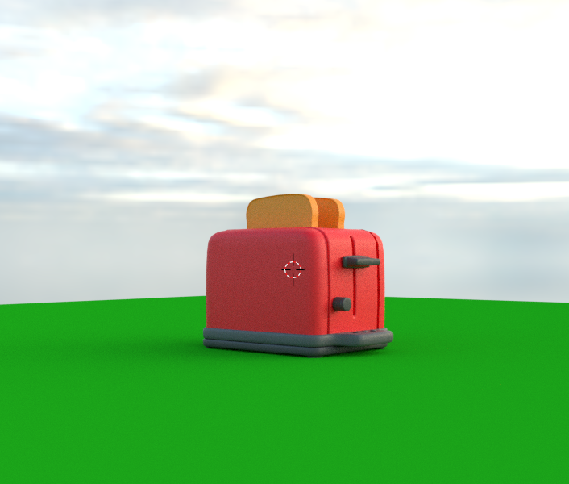
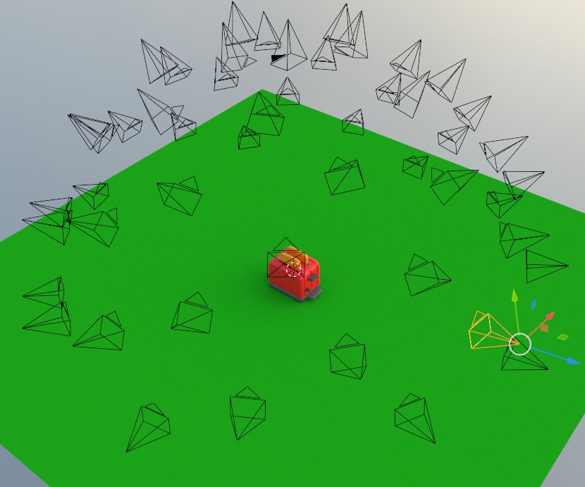

# Snap-it, Tap-it, Splat-it: Tactile-Informed 3D Gaussian Splatting for Reconstructing Challenging Surfaces

This is the official repository for the paper [Snap-it, Tap-it, Splat-it: Tactile-Informed 3D Gaussian Splatting for Reconstructing Challenging Surfaces](https://arxiv.org/abs/2403.20275). Our work introduces a method for combining the sense of robotic touch and vision within a 3D Gaussian Splatting for accurate object reconstruction. 

- [Installation](#installation)
- [Data](#data)
- [Training](#training)
- [Visualizer](#visualizer)
- [License](#notes-on-license)


If you find this helpful, please consider citing our work as suggested here:

```
@article{comi2024snap,
  title={Snap-it, Tap-it, Splat-it: Tactile-Informed 3D Gaussian Splatting for Reconstructing Challenging Surfaces},
  author={Comi, Mauro and Tonioni, Alessio and Yang, Max and Tremblay, Jonathan and Blukis, Valts and Lin, Yijiong and Lepora, Nathan F and Aitchison, Laurence},
  journal={arXiv preprint arXiv:2403.20275},
  year={2024}
}
```

# Installation
This code was tested on Ubuntu 22.04 and CUDA 11.6.

```bash
# Install the repository and requirements
git clone --recursive https://github.com/maurock/Dynamic3DGaussians.git
conda env create --file environment.yaml
conda activate dynamic_gaussians
conda install pytorch3d -c pytorch3d
pip install .

# Install differentiable rasterizer with depth
git clone --recursive https://github.com/maurock/depth-diff-gaussian-rasterization.git
pip install ./depth-diff-gaussian-rasterization
```

This version of the gaussian rasterizer is differentiable with respect to the depth map. 

# Data
Our paper uses two datasets: Shiny Blender and Glossy Synthetic.

## Shiny Blender
The Shiny Blender dataset provided in the [official implementation](https://dorverbin.github.io/refnerf/) needs to be adapted to be compatible with this repository. You can either download the adapted dataset or manually adapt it yourself by following the instructions below. 

### Download data (**Recommended**)
You can download the Shiny Blender dataset adapted for 3D Gaussian Splatting and local depths [HERE](https://uob-my.sharepoint.com/:f:/g/personal/ri21540_bristol_ac_uk/Eg1Dr-7c9ItNvk2oUU7iDIMB8dq8VrPtd1rbq8_qKfgixw?e=GkaEi4). Extract the data and place it under the  `data` folder. You should have this data structure:

```
root
 ├── data
 │   ├── shiny-blender-3DGS
 │   │   ├── car
 │   │   ├── coffee
 ... 
```

Alternatively, you can manually adapt the RefNeRF dataset by following the instructions below.
### Adapt dataset manually (Alternative)
#### Camera poses, point clouds, and images 
The script `data_making/refnerf_to_data.py` is included for converting the [RefNeRF](https://dorverbin.github.io/refnerf/) dataset, which contains data for shiny and reflective objects, to the format required by this repository. 
Please follow these steps:
- Download the **Shiny Blender Dataset** from the official [RefNeRF project page](https://dorverbin.github.io/refnerf/).
- Place the downloaded folder (`refnerf`) under the `data/` folder.
- Run `python data_making/refnerf_to_data.py` to convert the data in the required format. This script also runs COLMAP with the known camera poses included in the Shiny Blender dataset. The converted data is stored in `data/shiny-blender-3DGS`, e.g. `data/shiny-blender-3DGS/toaster`, ready to be used by the `train.py` script. 

Please note: local depth information is not extracted. Please follow the next steps for it.

#### Local depths
- Make sure you have `blender` installed on your system, so that you can run it via your command line. 
- Download `refnerf-blend` from the RefNeRF repository and place it under `data/`. Then, from the root project simply run:
```
bash data/extract_obj_from_blend.sh
```
This script extracts `.obj` files from all the `.blend` files in `data/refnerf-blend` and places them in `data/refnerf-blend/obj`.

- Finally, to extract simulated local depths, simply run:
```
python data_making/simulate_local_depth.py --dataset ShinyBlender
```

## Glossy Synthetic
### Download data (**Recommended**)
You can download the Glossy Synthetic dataset adapted for 3D Gaussian Splatting and local depths [HERE](https://uob-my.sharepoint.com/:f:/g/personal/ri21540_bristol_ac_uk/Eg1Dr-7c9ItNvk2oUU7iDIMB8dq8VrPtd1rbq8_qKfgixw?e=GkaEi4). Extract the data and place it under the `data/` folder. 

```
root
 ├── data
 │   ├── glossy-synthetic-3DGS
 │   │   ├── cat
 │   │   ├── angel
 ... 
```

Alternatively, you can manually adapt the Glossy Synthetic dataset by following the instructions below.
### Adapt dataset manually (Alternative)
#### Camera poses, point clouds, and images
- Download the required data: `Glossy Synthetic` (training set),  `glossy-synthetic-nvs` (test set), and `meshes-pretrained`. 
- Unzip them and place them under `data/`. 
- Run `python data_making/nero_to_refnerf.py`: this generates an intermediate Blender dataset called `glossy-synthetic-Blender`. This dataset has a similar format to Ref-NeRF.
- Run `python data_making/refnerf_to_data.py --dataset GlossySynthetic`: this generates the final dataset in the format required by this repository of Gaussian Splatting.

Please note: local depth information is not extracted. Please follow the next steps for it.

#### Local depths
- If you haven't downloaded `meshes-pretrained`, please donwload it, unzip it, and place it under `data/`. The structure should be:
```
data
 ├── meshes-pretrained
 │   ├── syn
 │   │   ├── cat.ply
 │   │   ├── ...
 │   ├── real  # <-- not necessary
```
- From the root project simply run:
```
python data_making/convert_ply_to_obj.py
```
This script converts the `.ply` files stored in `data/meshes-pretrained/syn` to `.obj` files needed to extract simulated local depths. These `.obj` files are stored in `data/meshes-pretrained/obj`.

- Finally, to extract simulated local depths, simply run:
```
python data_making/simulate_local_depth.py --dataset GlossySynthetic
```

# Training

Set the desired hyperparameters in `config/train.yaml` (more soon..)

Then, simply run
```
python train.py --config_path train.yaml
```
The ouput is placed under `output/<output_seq>/<exp_name>`.

# Visualizer

To visualise the result, please run:
```
python run_visualizer.py --dataset_dir <..> --exp_name <..> --output_seq <..> --obj <..>
```

<!-- Additionally, we provide a script for Blender.
## Blender: accurate camera poses and ground truth point cloud

This repository contains two important scripts for data extraction from Blender:
- `data_making/blender_script.py`: **Copy** this to your Blender script. This script gathers details about the cameras in your 3D scene and points on the surface of your object(s).  
- `data_making/blender_to_data.py`: Run this script post data extraction from Blender to structure your data in the correct format.

Below is an explanation of how these scripts work:
### `blender_script.py`
- Start by creating your object-centric scene in Blender:



- Paste the script into Blender's text editor, set the parameters at the beginning of the script, and run it. This script generates N cameras, uniformly distributed on a hemisphere surrounding the object, with each camera oriented towards the object. **Important**: please ensure that your file paths to save the extracted data are in a unified directory, e.g.
```
output_img_path = 'PROJECT_FOLDER/ims'
output_poses_path = 'PROJECT_FOLDER/cameras_gt.json' 
output_point_path = 'PROJECT_FOLDER/init_pt_cld.npz' 
```



### blender_to_data.py
Simply run this script from your root directory. Configure the arguments as needed, e.g
```
python blender_to_data.py --data_path Blender/PROJECT_FOLDER/ --output_path data/YOUR_DATASET
``` -->


# Notes on license
The code in this repository (except in external.py) is licensed under the MIT licence.

However, for this code to run it uses the cuda rasterizer code from [here](https://github.com/JonathonLuiten/diff-gaussian-rasterization-w-depth),
as well as various code in [external.py](./external.py) which has been taken or adapted from [here](https://github.com/graphdeco-inria/gaussian-splatting).
These are required for this project, and for these a much more restrictive license from Inria applies which can be found [here](https://github.com/graphdeco-inria/gaussian-splatting/blob/main/LICENSE.md).
This requires express permission (licensing agreements) from Inria for use in any commercial application, but is otherwise freely distributed for research and experimentation.
